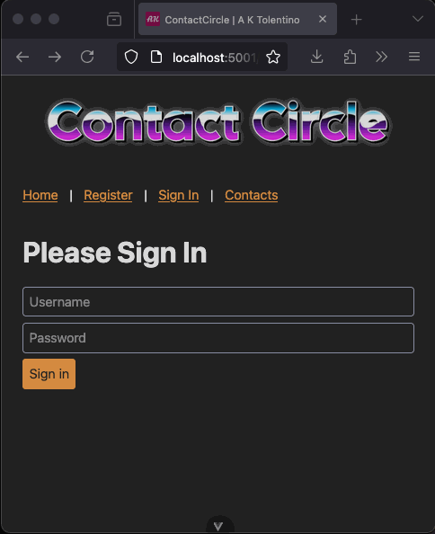

## Microservices using NextJs (API only), Vue and Docker

To demonstrate my know-how in microservices architecture, NextJs, Vue and Docker,
I created _ContactCircle_, which allows signed-in users to manage and shared their contacts with one another

[C4 Model Diagrams](documentation/c4-model-final.pdf) ([drive](https://drive.google.com/file/d/1qpt00gde7qXGwpL6vRM3DXq62kFrUnJO/view?usp=sharing))



## Prerequisites

1. NodeJS 18 (minimum)
2. [pnpm](https://pnpm.io/installation)
3. [Docker Desktop](https://docs.docker.com/desktop/setup/install/mac-install/)

## TDLR

```bash
pnpm install && \
pnpm run -r migrate && \
pnpm run -r playwright:install

pnpm run -r dev

docker compose up

pnpm run -r --parallel cqa
```

## Setup

1. `cd` into the project directory
2. Install dependencies:

   ```bash
   pnpm install
   ```

3. Set up the SQLite3 databases for each microservice:

   ```bash
    pnpm run -r migrate
    ```

4. Optionally, install Playwright browsers:

   ```bash
   pnpm run -r playwright:install
   ```

## Running

Access: [http://localhost:5001](http://localhost:5001)

1. Run conventionally:

   ```bash
   pnpm run -r dev
   ```
   
2. Or, run using Docker:

   ```bash
   docker compose up
   ```

## Code Quality Assurance

To run all E2E tests, unit tests and linting:

```bash
pnpm run -r --parallel cqa
```

## Approach

1. I decided to go with NextJs for the API
   1. Because it's the faster to setup -- but did not use its frontend features 
   2. Though I could have went with `http.createServer` -- but base on experience, there would be too much boilerplate
   3. I deemed that it was more important to focus on creating routes and business logic
   4. I only accepted the result of the Gen AI, if and only if, its something that I would have written myself anyway
2. Due to time constraints, I did use Gen AIs like GitHub Copilot
   1. But rest assured that I did not just blindly use them
   2. I understand it and it would have been the code that I would have wrote anyway
3. Decide to make it a POST-only API for Auth BE MX
   1. And RESTful API for the other microservices

## References

1. [Create a monorepo using PNPM workspace](https://dev.to/vinomanick/create-a-monorepo-using-pnpm-workspace-1ebn)
2. [Dont remove old local browser](https://github.com/microsoft/playwright/issues/15990)
